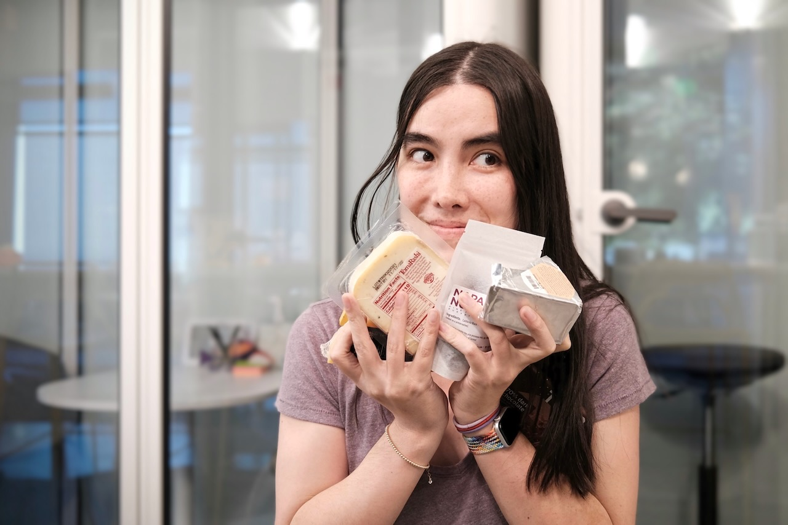
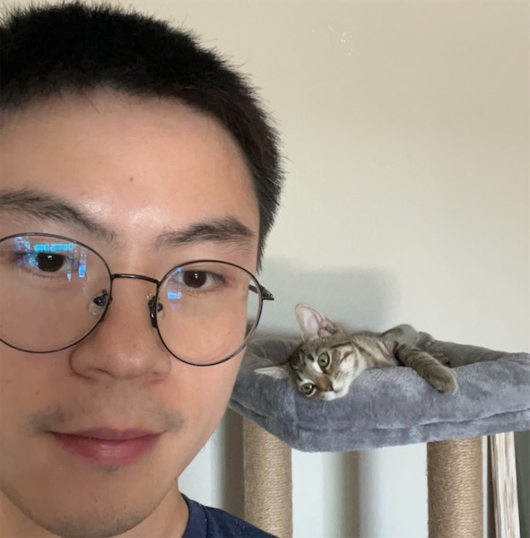

>
> These docs are old and won't be updated. Go to [react.dev](https://react.dev/) for the new React docs.
> 
> See the [Team](https://react.dev/community/team) page on the new site.

O desenvolvimento do React é liderado por uma pequena e dedicada equipe que trabalha em período integral no Meta. Ele também recebe contribuições de pessoas do mundo todo.

## Conheça a Equipe do React {#meet-the-react-team}

Os membros da equipe do React trabalham em tempo integral nas APIs dos componentes principais, no mecanismo que possibilita o React DOM e React Native, no React DevTools, e no website da documentação do React.

Os membros atuais da equipe do React estão listados em ordem alfabética abaixo.

### Andrew Clark {#andrew-clark}

[@acdlite no GitHub](https://github.com/acdlite) &middot; [@acdlite no Twitter](https://twitter.com/acdlite)

Andrew começou no desenvolvimento web criando sites com WordPress, e então se desafiou em trabalhar com JavaScript. Seu passatempo favorito é karaokê. Andrew pode ser um vilão da Disney ou uma princesa da Disney, dependendo do dia.

### Dan Abramov {#dan-abramov}

[@gaearon no GitHub](https://github.com/gaearon) &middot; [@dan_abramov no Twitter](https://twitter.com/dan_abramov)

Dan começou na programação depois de ter descoberto acidentalmente o Visual Basic no Microsoft PowerPoint. Ele encontrou seu verdadeiro chamado ao transformar os tweets do [Sebastian](#sebastian-markbage) em longos posts em um blog. Dan ocasionalmente ganha no Fortnite se escondendo atrás de um arbusto até o jogo terminar.

### Jason Bonta {#jason-bonta}

Jason gosta de receber grandes volumes de pacotes da Amazon no escritório para poder construir fortes. Apesar de literalmente se isolar de sua equipe às vezes e não entender como os loops for-of funcionam, nós o apreciamos pelas qualidades únicas que ele traz para seu trabalho.

### Joe Savona {#joe-savona}

[@josephsavona on GitHub](https://github.com/josephsavona) &middot; [@en_JS on Twitter](https://twitter.com/en_JS)

Joe estava planejando se formar em matemática e filosofia, mas entrou em ciência da computação depois de escrever simulações de física no Matlab. Antes do React, ele trabalhou em Relay, RSocket.js e na linguagem de programação Skip. Enquanto não está construindo algum tipo de sistema reativo, ele gosta de correr, estudar japonês e passar o tempo com sua família.

### Josh Story {#josh-story}

[@gnoff on GitHub](https://github.com/gnoff) &middot; [@joshcstory on Twitter](https://twitter.com/joshcstory)

Josh se formou em matemática e descobriu a programação enquanto estava na faculdade. Seu primeiro trabalho de desenvolvedor profissional foi programar cálculos de taxa de seguro no Microsoft Excel, o paradigma da Programação Reativa, que deve ser o motivo pelo qual ele agora trabalha no React. Nesse período, Josh foi IC, gerente e executivo em algumas startups. fora do trabalho, ele gosta de ultrapassar seus limites na culinária.

### Lauren Tan {#lauren-tan}

[@poteto on GitHub](https://github.com/poteto) &middot; [@potetotes on Twitter](https://twitter.com/potetotes)

A carreira de programação de Lauren atingiu o pico quando ela descobriu a tag `<marquee>`. Ela está perseguindo esse alto desde então. Quando ela não está adicionando bugs ao React, ela gosta de soltar memes atrevidos no bate-papo e jogando muitos videogames com seu parceiro e seu cachorro Zelda.

### Luna Ruan {#luna-ruan}

[@lunaruan no GitHub](https://github.com/lunaruan) &middot; [@lunaruan no Twitter](https://twitter.com/lunaruan)

Luna aprendeu a programar porque ela pensou que isso significava criar video games. Ao invés disso, ele acabou trabalhando no aplicativo web do Pinterest, e agora no próprio React. Luna não quer mais fazer video games, mas ela tem planos de praticar escrita criativa se ela se entediar.

### Mofei Zhang {#mofei-zhang}

[@mofeiZ on GitHub](https://github.com/mofeiZ)]

Mofei começou a programar quando percebeu que isso poderia ajudá-la a trapacear em videogames. Ela se concentrou em sistemas operacionais na graduação / pós-graduação, mas agora se vê alegremente mexendo no React. Fora do trabalho, ela gosta de depurar problemas de boulder e planejar suas próximas viages de mochila.

### Rick Hanlon {#rick-hanlon}

[@rickhanlonii no GitHub](https://github.com/rickhanlonii) &middot; [@rickhanlonii no Twitter](https://twitter.com/rickhanlonii)

Ricky se formou em matemática teórica e de alguma forma se encontrou na equipe React Native por alguns anos antes de ingressar na equipe React. Quando ele não está programando, você pode encontrá-lo no snowboard, ciclismo, escalada, golfe ou fechando issues do GitHub que não correspondem ao issue template.

### Samuel Susla {#samuel-susla}

[@sammy-SC on GitHub](https://github.com/sammy-SC) &middot; [@SamuelSusla on Twitter](https://twitter.com/SamuelSusla)

O interesse de Samuel pela programação começou com o filme Matrix. Ele ainda tem o protetor de tela Matrix. Antes de trabalhar no React, ele se concentrava em escrever aplicativos para iOS. Fora do trabalho, Samuel gosta de jogar vôlei de praia, squash, badminton e passar o tempo com a família.

### Sathya Gunasekaran {#sathya-gunasekaran}

[@gsathya on GitHub](https://github.com/gsathya) &middot; [@_gsathya on Twitter](https://twitter.com/_gsathya)

Sathya odiava o Dragon Book na escola, mas de alguma forma acabou trabalhando em compiladores durante toda a sua carreira. Quando ele não está compilando componentes do React, ele está bebendo café ou comendo outro Dosa.

### Sebastian Markbåge {#sebastian-markbage}

[@sebmarkbage no GitHub](https://github.com/sebmarkbage) &middot; [@sebmarkbage no Twitter](https://twitter.com/sebmarkbage)

Sebastian é graduado em psicologia. Ele é geralmente quieto. Mesmo quando ele diz algo, geralmente não faz muito sentido para o restante de nós até alguns meses depois. A maneira correta de pronunciar seu sobrenome é "mark-boa-geh" mas ele aceita com "mark-beige" sem ser pragmático -- e essa também é a abordagem dele com o React.

### Sebastian Silbermann {#sebastian-silbermann}

[@eps1lon on GitHub](https://github.com/eps1lon) &middot; [@sebsilbermann on Twitter](https://twitter.com/sebsilbermann)

Sebastian aprendeu a programar para tornar os jogos de navegador que ele jogava durante as aulas mais agradáveis. Eventualmente, isso levou a contribuir com o máximo possível de código-fonte aberto. Fora da codificação, ele está ocupado garantindo que as pessoas não o confundam com os outros Sebastians e Zilberman da comunidade React.

### Seth Webster {#seth-webster}

[@sethwebster no GitHub](https://github.com/sethwebster) &middot; [@sethwebster no Twitter](https://twitter.com/sethwebster)

Seth começou a programar quando criança em Tucson, AZ. Depois da escola, ele foi mordido pelo bug da música e foi músico em turnê por cerca de 10 anos antes de retornar ao *trabalho*, começando com a Intuit. Em seu tempo livre, ele adora [tirar fotos](https://www.sethwebster.com) e voar para resgatar animais no nordeste dos Estados Unidos.

### Sophie Alpert {#sophie-alpert}

[@sophiebits on GitHub](https://github.com/sophiebits) &middot; [@sophiebits on Twitter](https://twitter.com/sophiebits)

Quatro dias após o lançamento do React, Sophie reescreveu todo o seu projeto então atual para usá-lo, o que ela agora percebe que talvez tenha sido um pouco imprudente. Depois que ela se tornou a comprometedora número 1 do projeto, ela se perguntou por que não estava sendo paga pelo Facebook como todo mundo e se juntou à equipe oficialmente para liderar o React durante sua adolescência. Embora ela tenha deixado o emprego anos atrás, de alguma forma ela ainda está nos chats de grupo da equipe e “fornecendo valor”.

### Tianyu Yao {#tianyu-yao}

[@tyao1 on GitHub](https://github.com/tyao1) &middot; [@tianyu0 on Twitter](https://twitter.com/tianyu0)

O interesse de Tianyu por computadores começou quando criança porque ele adora videogames. Então ele se formou em ciência da computação e ainda joga jogos infantis como League of Legends. Quando não está na frente do computador, gosta de brincar com seus dois gatinhos, fazer caminhadas e andar de caiaque.

### Yuzhi Zheng {#yuzhi-zheng}

[@yuzhi on GitHub](https://github.com/yuzhi) &middot; [@yuzhiz on Twitter](https://twitter.com/yuzhiz)

Yuzhi estudou Ciência da Computação na escola. Ela gostou da gratificação instantânea de ver o código ganhar vida sem ter que estar fisicamente em um laboratório. Agora ela é gerente na organização React. Antes da gestão, ela costumava trabalhar na estrutura de busca de dados do Relay. Em seu tempo livre, Yuzhi gosta de otimizar sua vida por meio de projetos de jardinagem e melhorias domésticas.

## Reconhecimentos {#acknowledgements}

React foi originalmente criado por [Jordan Walke](https://github.com/jordwalke). Atualmente, o React tem mais de mil contribuintes open source. Nos gostaríamos de reconhecer algumas pessoas que fizeram contribuições significativas para o React e sua documentação no passado e tem ajudado a mantê-lo ao longo dos anos:

* [Almero Steyn](https://github.com/AlmeroSteyn)
* [Andreas Svensson](https://github.com/syranide)
* [Alex Krolick](https://github.com/alexkrolick)
* [Alexey Pyltsyn](https://github.com/lex111)
* [Brandon Dail](https://github.com/aweary)
* [Brian Vaughn](https://github.com/bvaughn)
* [Caleb Meredith](https://github.com/calebmer)
* [Chang Yan](https://github.com/cyan33)
* [Cheng Lou](https://github.com/chenglou)
* [Christoph Nakazawa](https://github.com/cpojer)
* [Christopher Chedeau](https://github.com/vjeux)
* [Clement Hoang](https://github.com/clemmy)
* [Dominic Gannaway](https://github.com/trueadm)
* [Flarnie Marchan](https://github.com/flarnie)
* [Jason Quense](https://github.com/jquense)
* [Jesse Beach](https://github.com/jessebeach)
* [Jessica Franco](https://github.com/Jessidhia)
* [Jim Sproch](https://github.com/jimfb)
* [Josh Duck](https://github.com/joshduck)
* [Joe Critchley](https://github.com/joecritch)
* [Jeff Morrison](https://github.com/jeffmo)
* [Keyan Zhang](https://github.com/keyz)
* [Marco Salazar](https://github.com/salazarm)
* [Nat Alison](https://github.com/tesseralis)
* [Nathan Hunzaker](https://github.com/nhunzaker)
* [Nicolas Gallagher](https://github.com/necolas)
* [Paul O'Shannessy](https://github.com/zpao)
* [Pete Hunt](https://github.com/petehunt)
* [Philipp Spiess](https://github.com/philipp-spiess)
* [Rachel Nabors](https://github.com/rachelnabors)
* [Robert Zhang](https://github.com/robertzhidealx)
* [Sander Spies](https://github.com/sanderspies)
* [Sasha Aickin](https://github.com/aickin)
* [Sophia Shoemaker](https://github.com/mrscobbler)
* [Sunil Pai](https://github.com/threepointone)
* [Tim Yung](https://github.com/yungsters)
* [Xuan Huang](https://github.com/huxpro)

Essa lista não é exaustiva.

Gostaríamos de agradecer especialmente a [Tom Occhino](https://github.com/tomocchino) e [Adam Wolff](https://github.com/wolffiex) por sua orientação e suporte ao longo dos anos. Também gostaríamos de agradecer a todos os voluntários que [traduziram o React para outros idiomas](https://translations.reactjs.org/).
