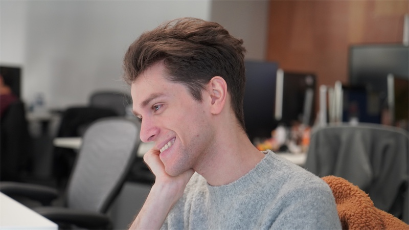
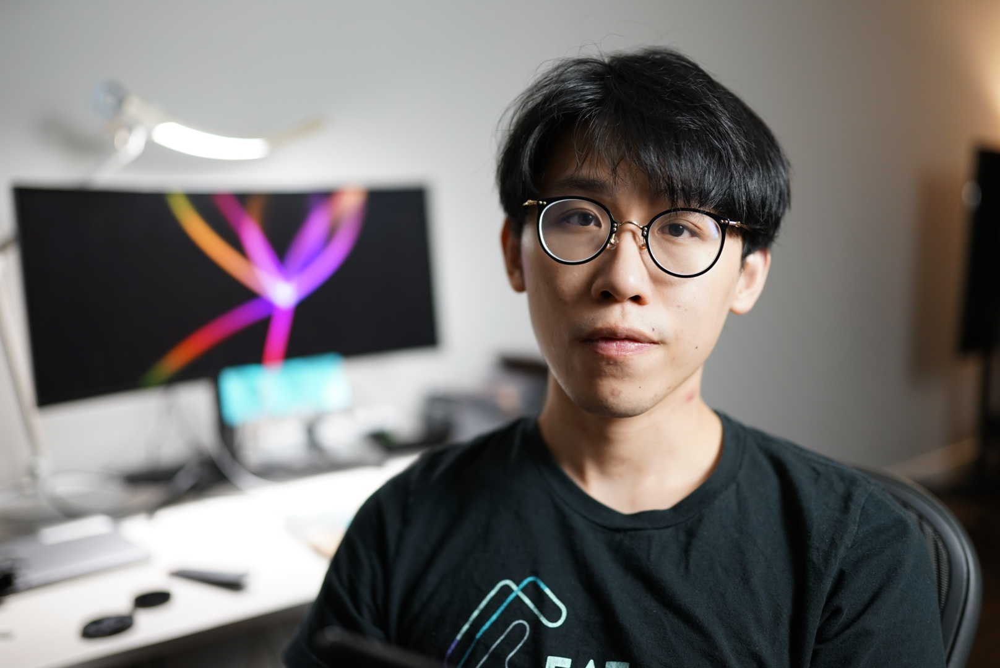

O desenvolvimento do React é liderado por uma pequena e dedicada equipe que trabalha em período integral no Facebook. Ele também recebe contribuições de pessoas do mundo todo.

## Conheça a Equipe do React {#meet-the-react-team}

Os membros da equipe do React trabalham em tempo integral nas APIs dos componentes principais, no mecanismo que possibilita o React DOM e React Native, no React DevTools, e no website da documentação do React.

Os membros atuais da equipe do React estão listados em ordem alfabética abaixo.

### Andrew Clark {#andrew-clark}

[@acdlite no GitHub](https://github.com/acdlite) &middot; [@acdlite no Twitter](https://twitter.com/acdlite)

Andrew começou no desenvolvimento web criando sites com WordPress, e então se desafiou em trabalhar com JavaScript. Seu passatempo favorito é karaokê. Andrew pode ser um vilão da Disney ou uma princesa da Disney, dependendo do dia.

### Brian Vaughn {#brian-vaughn}

[@bvaughn no GitHub](https://github.com/bvaughn) &middot; [@brian\_d\_vaughn no Twitter](https://twitter.com/brian_d_vaughn)

Brian estudou artes na faculdade e trabalhou com programação para pagar seus estudos. No final, ele percebeu que ele gosta de trabalhar com open source. Brian tem uma [banda solo](https://soundcloud.com/brianvaughn/) e duas [bandas](https://soundcloud.com/pilotlessdrone) [de duas pessoas](https://soundcloud.com/pinwurm). Ele também cuida do gato mais fofo do mundo.

### Dan Abramov {#dan-abramov}

[@gaearon no GitHub](https://github.com/gaearon) &middot; [@dan_abramov no Twitter](https://twitter.com/dan_abramov)

Dan começou na programação depois de ter descoberto acidentalmente o Visual Basic no Microsoft PowerPoint. Ele encontrou seu verdadeiro chamado ao transformar os tweets do [Sebastian](#sebastian-markbage) em longos posts em um blog. Dan ocasionalmente ganha no Fortnite se escondendo atrás de um arbusto até o jogo terminar.

### Luna Ruan {#luna-ruan}

[@lunaruan no GitHub](https://github.com/lunaruan) &middot; [@lunaruan no Twitter](https://twitter.com/lunaruan)

Luna aprendeu a programar porque ela pensou que isso significava criar video games. Ao invés disso, ele acabou trabalhando no aplicativo web do Pinterest, e agora no próprio React. Luna não quer mais fazer video games, mas ela tem planos de praticar escrita criativa se ela se entediar.

### Marco Salazar {#marco-salazar}

[@salazarm on GitHub](https://github.com/salazarm) &middot; [@BkOptimism on Twitter](https://twitter.com/BkOptimism)

A primeira linguagem de programação de Marco foi a Assembly porque ele poderia usá-la para hackear videogames. Agora, os jogos online são muito mais seguros, então ele se contenta em jogar de forma justa (principalmente). Em seu tempo livre, ele joga em sua mesa de esteira e faz arte que nunca termina. Esperançosamente, seus PRs não terão o mesmo destino.

### Rachel Nabors {#rachel-nabors}

[@rachelnabors no GitHub](https://github.com/rachelnabors) &middot; [@rachelnabors no Twitter](https://twitter.com/rachelnabors)

Rachel escreveu um [livro sobre animação de interface de usuário](https://abookapart.com/products/animation-at-work) e trabalhou com MDN e o W3C na API de animações web. Agora ela está ocupada com materiais educativos e engenharia comunitária na equipe do React. Secretamente, ela é uma premiada cartunista para garotas adolescentes. Encontre ela fazendo chás glamourosos com água morna no microondas.

### Rick Hanlon {#rick-hanlon}

[@rickhanlonii no GitHub](https://github.com/rickhanlonii) &middot; [@rickhanlonii no Twitter](https://twitter.com/rickhanlonii)

Ricky se formou em matemática teórica e de alguma forma se encontrou na equipe React Native por alguns anos antes de ingressar na equipe React. Quando ele não está programando, você pode encontrá-lo no snowboard, ciclismo, escalada, golfe ou fechando issues do GitHub que não correspondem ao issue template.

### Sebastian Markbåge {#sebastian-markbage}

[@sebmarkbage no GitHub](https://github.com/sebmarkbage) &middot; [@sebmarkbage no Twitter](https://twitter.com/sebmarkbage)

Sebastian é graduado em psicologia. Ele é geralmente quieto. Mesmo quando ele diz algo, geralmente não faz muito sentido para o restante de nós até alguns meses depois. A maneira correta de pronunciar seu sobrenome é "mark-boa-geh" mas ele aceita com "mark-beige" sem ser pragmático -- e essa também é a abordagem dele com o React.

### Seth Webster {#seth-webster}

[@sethwebster no GitHub](https://github.com/sethwebster) &middot; [@sethwebster no Twitter](https://twitter.com/sethwebster)

Seth começou a programar quando criança em Tucson, AZ. Depois da escola, ele foi mordido pelo bug da música e foi músico em turnê por cerca de 10 anos antes de retornar ao *trabalho*, começando com a Intuit. Em seu tempo livre, ele adora [tirar fotos](https://www.sethwebster.com) e voar para resgatar animais no nordeste dos Estados Unidos.

<<<<<<< HEAD
## Reconhecimentos {#acknowledgements}
=======
### Xuan Huang {#xuan-huang}

[@huxpro on GitHub](https://github.com/huxpro) &middot; [@huxpro on Twitter](https://twitter.com/huxpro)

Xuan met with programming in childhood to make games in Flash. He did digital media arts in college but eventually got tricked into making compilers, and somehow React needs one. Out of work, he pours terrible latte arts and plays tennis either on or off a table.

## Acknowledgements {#acknowledgements}
>>>>>>> 1a641bb88e647186f260dd2a8e56f0b083f2e46b

React foi originalmente criado por [Jordan Walke](https://github.com/jordwalke). Atualmente, o React tem mais de mil contribuintes open source. Nos gostaríamos de reconhecer algumas pessoas que fizeram contribuições significativas para o React e sua documentação no passado e tem ajudado a mantê-lo ao longo dos anos:

* [Almero Steyn](https://github.com/AlmeroSteyn)
* [Andreas Svensson](https://github.com/syranide)
* [Alex Krolick](https://github.com/alexkrolick)
* [Alexey Pyltsyn](https://github.com/lex111)
* [Brandon Dail](https://github.com/aweary)
* [Caleb Meredith](https://github.com/calebmer)
* [Chang Yan](https://github.com/cyan33)
* [Cheng Lou](https://github.com/chenglou)
* [Christoph Nakazawa](https://github.com/cpojer)
* [Christopher Chedeau](https://github.com/vjeux)
* [Clement Hoang](https://github.com/clemmy)
* [Dominic Gannaway](https://github.com/trueadm)
* [Flarnie Marchan](https://github.com/flarnie)
* [Jason Quense](https://github.com/jquense)
* [Jesse Beach](https://github.com/jessebeach)
* [Jessica Franco](https://github.com/Jessidhia)
* [Jim Sproch](https://github.com/jimfb)
* [Josh Duck](https://github.com/joshduck)
* [Joe Critchley](https://github.com/joecritch)
* [Jeff Morrison](https://github.com/jeffmo)
* [Keyan Zhang](https://github.com/keyz)
* [Nat Alison](https://github.com/tesseralis)
* [Nathan Hunzaker](https://github.com/nhunzaker)
* [Nicolas Gallagher](https://github.com/necolas)
* [Paul O'Shannessy](https://github.com/zpao)
* [Pete Hunt](https://github.com/petehunt)
* [Philipp Spiess](https://github.com/philipp-spiess)
* [Robert Zhang](https://github.com/robertzhidealx)
* [Sander Spies](https://github.com/sanderspies)
* [Sasha Aickin](https://github.com/aickin)
* [Sophia Shoemaker](https://github.com/mrscobbler)
* [Sophie Alpert](https://github.com/sophiebits)
* [Sunil Pai](https://github.com/threepointone)
* [Tim Yung](https://github.com/yungsters)
* [Yuzhi Zheng](https://github.com/yuzhi)

Essa lista não é exaustiva.

<<<<<<< HEAD
Nós gostaríamos de agradecer especialmente ao [Tom Occhino](https://github.com/tomocchino) e [Adam Wolff](https://github.com/wolffiex) por nos guiar e apoiar ao longo dos anos. Nós também gostaríamos de agradecer a todos os voluntários que [traduziram o React para outros idiomas](https://translations.reactjs.org/).
=======
We'd like to give special thanks to [Tom Occhino](https://github.com/tomocchino) and [Adam Wolff](https://github.com/wolffiex) for their guidance and support over the years. We'd also like to thank all the volunteers who [translated React into other languages](https://translations.reactjs.org/).
>>>>>>> 1a641bb88e647186f260dd2a8e56f0b083f2e46b
