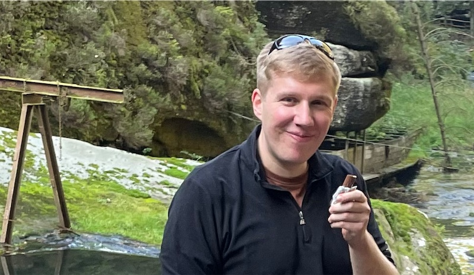

<<<<<<< HEAD
O desenvolvimento do React é liderado por uma pequena e dedicada equipe que trabalha em período integral no Facebook. Ele também recebe contribuições de pessoas do mundo todo.
=======
React development is led by a small dedicated team working full time at Meta. It also receives contributions from people all over the world.
>>>>>>> 38bf76a4a7bec6072d086ce8efdeef9ebb7af227

## Conheça a Equipe do React {#meet-the-react-team}

Os membros da equipe do React trabalham em tempo integral nas APIs dos componentes principais, no mecanismo que possibilita o React DOM e React Native, no React DevTools, e no website da documentação do React.

Os membros atuais da equipe do React estão listados em ordem alfabética abaixo.

### Andrew Clark {#andrew-clark}

[@acdlite no GitHub](https://github.com/acdlite) &middot; [@acdlite no Twitter](https://twitter.com/acdlite)

Andrew começou no desenvolvimento web criando sites com WordPress, e então se desafiou em trabalhar com JavaScript. Seu passatempo favorito é karaokê. Andrew pode ser um vilão da Disney ou uma princesa da Disney, dependendo do dia.

<<<<<<< HEAD
### Brian Vaughn {#brian-vaughn}

[@bvaughn no GitHub](https://github.com/bvaughn) &middot; [@brian\_d\_vaughn no Twitter](https://twitter.com/brian_d_vaughn)

Brian estudou artes na faculdade e trabalhou com programação para pagar seus estudos. No final, ele percebeu que ele gosta de trabalhar com open source. Brian tem uma [banda solo](https://soundcloud.com/brianvaughn/) e duas [bandas](https://soundcloud.com/pilotlessdrone) [de duas pessoas](https://soundcloud.com/pinwurm). Ele também cuida do gato mais fofo do mundo.

=======
>>>>>>> 38bf76a4a7bec6072d086ce8efdeef9ebb7af227
### Dan Abramov {#dan-abramov}

[@gaearon no GitHub](https://github.com/gaearon) &middot; [@dan_abramov no Twitter](https://twitter.com/dan_abramov)

Dan começou na programação depois de ter descoberto acidentalmente o Visual Basic no Microsoft PowerPoint. Ele encontrou seu verdadeiro chamado ao transformar os tweets do [Sebastian](#sebastian-markbage) em longos posts em um blog. Dan ocasionalmente ganha no Fortnite se escondendo atrás de um arbusto até o jogo terminar.

### Jason Bonta {#jason-bonta}

Jason likes having large volumes of Amazon packages delivered to the office so that he can build forts. Despite literally walling himself off from his team at times and not understanding how for-of loops work, we appreciate him for the unique qualities he brings to his work. 

### Joe Savona {#joe-savona}

[@josephsavona on GitHub](https://github.com/josephsavona) &middot; [@en_JS on Twitter](https://twitter.com/en_JS)

Joe was planning to major in math and philosophy but got into computer science after writing physics simulations in Matlab. Prior to React, he worked on Relay, RSocket.js, and the Skip programming language. While he’s not building some sort of reactive system he enjoys running, studying Japanese, and spending time with his family.

### Josh Story {#josh-story}

[@gnoff on GitHub](https://github.com/gnoff) &middot; [@joshcstory on Twitter](https://twitter.com/joshcstory)

Josh majored in Mathematics and discovered programming while in college. His first professional developer job was to program insurance rate calculations in Microsoft Excel, the paragon of Reactive Programming which must be why he now works on React. In between that time Josh has been an IC, Manager, and Executive at a few startups. outside of work he likes to push his limits with cooking.

### Lauren Tan {#lauren-tan}

[@poteto on GitHub](https://github.com/poteto) &middot; [@potetotes on Twitter](https://twitter.com/potetotes)

Lauren’s programming career peaked when she first discovered the `<marquee>` tag. She’s been chasing that high ever since. When she’s not adding bugs into React, she enjoys dropping cheeky memes in chat, and playing all too many video games with her partner, and her dog Zelda.

### Luna Ruan {#luna-ruan}

[@lunaruan no GitHub](https://github.com/lunaruan) &middot; [@lunaruan no Twitter](https://twitter.com/lunaruan)

Luna aprendeu a programar porque ela pensou que isso significava criar video games. Ao invés disso, ele acabou trabalhando no aplicativo web do Pinterest, e agora no próprio React. Luna não quer mais fazer video games, mas ela tem planos de praticar escrita criativa se ela se entediar.

### Mofei Zhang {#mofei-zhang}

[@mofeiZ on GitHub](https://github.com/mofeiZ)]

<<<<<<< HEAD
A primeira linguagem de programação de Marco foi a Assembly porque ele poderia usá-la para hackear videogames. Agora, os jogos online são muito mais seguros, então ele se contenta em jogar de forma justa (principalmente). Em seu tempo livre, ele joga em sua mesa de esteira e faz arte que nunca termina. Esperançosamente, seus PRs não terão o mesmo destino.

### Rachel Nabors {#rachel-nabors}

[@rachelnabors no GitHub](https://github.com/rachelnabors) &middot; [@rachelnabors no Twitter](https://twitter.com/rachelnabors)

Rachel escreveu um [livro sobre animação de interface de usuário](https://abookapart.com/products/animation-at-work) e trabalhou com MDN e o W3C na API de animações web. Agora ela está ocupada com materiais educativos e engenharia comunitária na equipe do React. Secretamente, ela é uma premiada cartunista para garotas adolescentes. Encontre ela fazendo chás glamourosos com água morna no microondas.
=======
Mofei started programming when she realized it can help her cheat in video games. She focused on operating systems in undergrad / grad school, but now finds herself happily tinkering on React. Outside of work, she enjoys debugging bouldering problems and planning her next backpacking trip(s).
>>>>>>> 38bf76a4a7bec6072d086ce8efdeef9ebb7af227

### Rick Hanlon {#rick-hanlon}

[@rickhanlonii no GitHub](https://github.com/rickhanlonii) &middot; [@rickhanlonii no Twitter](https://twitter.com/rickhanlonii)

Ricky se formou em matemática teórica e de alguma forma se encontrou na equipe React Native por alguns anos antes de ingressar na equipe React. Quando ele não está programando, você pode encontrá-lo no snowboard, ciclismo, escalada, golfe ou fechando issues do GitHub que não correspondem ao issue template.

### Samuel Susla {#samuel-susla}

[@sammy-SC on GitHub](https://github.com/sammy-SC) &middot; [@SamuelSusla on Twitter](https://twitter.com/SamuelSusla)

Samuel’s interest in programming started with the movie Matrix. He still has Matrix screen saver. Before working on React, he was focused on writing iOS apps. Outside of work, Samuel enjoys playing beach volleyball, squash, badminton and spending time with his family.

### Sathya Gunasekaran {#sathya-gunasekaran}

[@gsathya on GitHub](https://github.com/gsathya) &middot; [@_gsathya on Twitter](https://twitter.com/_gsathya)

Sathya hated the Dragon Book in school but somehow ended up working on compilers all his career. When he's not compiling React components, he's either drinking coffee or eating yet another Dosa.

### Sebastian Markbåge {#sebastian-markbage}

[@sebmarkbage no GitHub](https://github.com/sebmarkbage) &middot; [@sebmarkbage no Twitter](https://twitter.com/sebmarkbage)

Sebastian é graduado em psicologia. Ele é geralmente quieto. Mesmo quando ele diz algo, geralmente não faz muito sentido para o restante de nós até alguns meses depois. A maneira correta de pronunciar seu sobrenome é "mark-boa-geh" mas ele aceita com "mark-beige" sem ser pragmático -- e essa também é a abordagem dele com o React.

### Sebastian Silbermann {#sebastian-silbermann}

[@eps1lon on GitHub](https://github.com/eps1lon) &middot; [@sebsilbermann on Twitter](https://twitter.com/sebsilbermann)

Sebastian learned programming to make the browser games he played during class more enjoyable. Eventually this lead to contributing to as much open source code as possible. Outside of coding he's busy making sure people don't confuse him with the other Sebastians and Zilberman of the React community.

### Seth Webster {#seth-webster}

[@sethwebster no GitHub](https://github.com/sethwebster) &middot; [@sethwebster no Twitter](https://twitter.com/sethwebster)

Seth começou a programar quando criança em Tucson, AZ. Depois da escola, ele foi mordido pelo bug da música e foi músico em turnê por cerca de 10 anos antes de retornar ao *trabalho*, começando com a Intuit. Em seu tempo livre, ele adora [tirar fotos](https://www.sethwebster.com) e voar para resgatar animais no nordeste dos Estados Unidos.

<<<<<<< HEAD
## Reconhecimentos {#acknowledgements}
=======
### Sophie Alpert {#sophie-alpert}

[@sophiebits on GitHub](https://github.com/sophiebits) &middot; [@sophiebits on Twitter](https://twitter.com/sophiebits)

Four days after React was released, Sophie rewrote the entirety of her then-current project to use it, which she now realizes was perhaps a bit reckless. After she became the project's #1 committer, she wondered why she wasn't getting paid by Facebook like everyone else was and joined the team officially to lead React through its adolescent years. Though she quit that job years ago, somehow she's still in the team's group chats and “providing value”.

### Tianyu Yao {#tianyu-yao}

[@tyao1 on GitHub](https://github.com/tyao1) &middot; [@tianyu0 on Twitter](https://twitter.com/tianyu0)

Tianyu’s interest in computers started as a kid because he loves video games. So he majored in computer science and still plays childish games like League of Legends. When he is not in front of a computer, he enjoys playing with his two kittens, hiking and kayaking.

### Yuzhi Zheng {#yuzhi-zheng}

[@yuzhi on GitHub](https://github.com/yuzhi) &middot; [@yuzhiz on Twitter](https://twitter.com/yuzhiz)

Yuzhi studied Computer Science in school. She liked the instant gratification of seeing code come to life without having to physically be in a laboratory. Now she’s a manager in the React org. Before management, she used to work on the Relay data fetching framework. In her spare time, Yuzhi enjoys optimizing her life via gardening and home improvement projects.

## Acknowledgements {#acknowledgements}
>>>>>>> 38bf76a4a7bec6072d086ce8efdeef9ebb7af227

React foi originalmente criado por [Jordan Walke](https://github.com/jordwalke). Atualmente, o React tem mais de mil contribuintes open source. Nos gostaríamos de reconhecer algumas pessoas que fizeram contribuições significativas para o React e sua documentação no passado e tem ajudado a mantê-lo ao longo dos anos:

* [Almero Steyn](https://github.com/AlmeroSteyn)
* [Andreas Svensson](https://github.com/syranide)
* [Alex Krolick](https://github.com/alexkrolick)
* [Alexey Pyltsyn](https://github.com/lex111)
* [Brandon Dail](https://github.com/aweary)
* [Brian Vaughn](https://github.com/bvaughn)
* [Caleb Meredith](https://github.com/calebmer)
* [Chang Yan](https://github.com/cyan33)
* [Cheng Lou](https://github.com/chenglou)
* [Christoph Nakazawa](https://github.com/cpojer)
* [Christopher Chedeau](https://github.com/vjeux)
* [Clement Hoang](https://github.com/clemmy)
* [Dominic Gannaway](https://github.com/trueadm)
* [Flarnie Marchan](https://github.com/flarnie)
* [Jason Quense](https://github.com/jquense)
* [Jesse Beach](https://github.com/jessebeach)
* [Jessica Franco](https://github.com/Jessidhia)
* [Jim Sproch](https://github.com/jimfb)
* [Josh Duck](https://github.com/joshduck)
* [Joe Critchley](https://github.com/joecritch)
* [Jeff Morrison](https://github.com/jeffmo)
* [Keyan Zhang](https://github.com/keyz)
* [Marco Salazar](https://github.com/salazarm)
* [Nat Alison](https://github.com/tesseralis)
* [Nathan Hunzaker](https://github.com/nhunzaker)
* [Nicolas Gallagher](https://github.com/necolas)
* [Paul O'Shannessy](https://github.com/zpao)
* [Pete Hunt](https://github.com/petehunt)
* [Philipp Spiess](https://github.com/philipp-spiess)
* [Rachel Nabors](https://github.com/rachelnabors)
* [Robert Zhang](https://github.com/robertzhidealx)
* [Sander Spies](https://github.com/sanderspies)
* [Sasha Aickin](https://github.com/aickin)
* [Sophia Shoemaker](https://github.com/mrscobbler)
* [Sunil Pai](https://github.com/threepointone)
* [Tim Yung](https://github.com/yungsters)
* [Xuan Huang](https://github.com/huxpro)

Essa lista não é exaustiva.

<<<<<<< HEAD
Nós gostaríamos de agradecer especialmente ao [Tom Occhino](https://github.com/tomocchino) e [Adam Wolff](https://github.com/wolffiex) por nos guiar e apoiar ao longo dos anos. Nós também gostaríamos de agradecer a todos os voluntários que [traduziram o React para outros idiomas](https://translations.reactjs.org/).
=======
We'd like to give special thanks to [Tom Occhino](https://github.com/tomocchino) and [Adam Wolff](https://github.com/wolffiex) for their guidance and support over the years. We'd also like to thank all the volunteers who [translated React into other languages](https://translations.reactjs.org/).
>>>>>>> 38bf76a4a7bec6072d086ce8efdeef9ebb7af227
