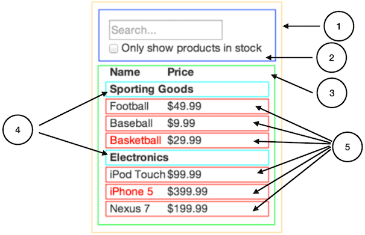

React é, na nossa opinião, o principal modo de se construir aplicações Web grandes e rápidas com JavaScript. Ele tem escalado muito bem para nós no Facebook e Instagram.

Uma das muitas excelentes partes do React é o modo que ele faz você pensar sobre apps enquanto os constrói. Neste documento, nós iremos ensinar o processo mental envolvido na construção de uma tabela de produtos buscáveis utilizando o React.

## Comece Com Um Mock {#start-with-a-mock}

Imagine que nós tenhamos uma API JSON e um mock desenvolvido pelo nosso designer. O mock se parece com isso:


Nossa API JSON retorna dados como esses:

```
[
  {category: "Sporting Goods", price: "$49.99", stocked: true, name: "Football"},
  {category: "Sporting Goods", price: "$9.99", stocked: true, name: "Baseball"},
  {category: "Sporting Goods", price: "$29.99", stocked: false, name: "Basketball"},
  {category: "Electronics", price: "$99.99", stocked: true, name: "iPod Touch"},
  {category: "Electronics", price: "$399.99", stocked: false, name: "iPhone 5"},
  {category: "Electronics", price: "$199.99", stocked: true, name: "Nexus 7"}
];
```

## Passo 1: Separe a UI Em Uma Hierarquia De Componentes{#step-1-break-the-ui-into-a-component-hierarchy}

A primeira coisa que você vai querer fazer é dar nomes e desenhar retângulos em volta de cada componente (e subcomponente) do mock. Se você estiver trabalhando com designers, eles podem já ter feito isso, então vá falar com eles! Os nomes das camadas no Photoshop podem acabar sendo os nomes dos seus componentes React!

Mas como você sabe o que deveria ser seu próprio componente? Use as mesmas técnicas que você usaria para decidir se você deveria criar uma nova função ou objeto. Uma dessas técnicas é o [princípio da responsabilidade única](https://en.wikipedia.org/wiki/Single_responsibility_principle), ou seja, um componente deve idealmente fazer apenas uma coisa. Se ele acabar crescendo, deverá ser decomposto em subcomponentes menores.

Visto que você estará frequentemente exibindo um modelo de dados em JSON ao usuário, você perceberá que caso o seu modelo esteja corretamente construído, sua UI (e portanto a sua estrutura de componente) será mapeada satisfatoriamente. Isso acontece pois UI e modelo de dados tendem a aderir à mesma *arquitetura de informação*. Separe sua UI em componentes, onde cada componente corresponde a uma parte do seu modelo de dados.



Você verá que nós temos cinco componentes nessa aplicação. Em itálico estão os dados que cada componente representa.

  1. **`FilterableProductTable` (laranja):** contém a totalidade do exemplo
  2. **`SearchBar` (azul):** recebe todo *input do usuário*
  3. **`ProductTable` (verde):** exibe e filtra a *coleção de dados* baseado no *input do usuário*
  4. **`ProductCategoryRow` (turquesa):** exibe um cabeçalho para cada *categoria*
  5. **`ProductRow` (vermelho):** exibe uma linha para cada *produto*

Se você olhar para `ProductTable`, verá que o cabeçalho da tabela (contendo as etiquetas "Name" and "Price") não é um componente separado. Isso é uma questão de preferência, e pode-se fazer um argumento contrário. Para esse exemplo, nós o deixamos como parte de `ProductTable` pois o cabeçalho faz parte da renderização da *coleção de dados*, que é responsabilidade de `ProductTable`. Entretanto, se a sua complexidade aumentar (e.g. se nós adicionássemos a capacidade de ordenação), certamente faria sentido a criação do componente `ProductTableHeader`.

Agora que nós já identificamos os componentes do nosso mock, vamos organizá-los em uma hierarquia. Componentes que aparecem dentro de outros no mock devem aparecer como filhos na hierarquia:

  * `FilterableProductTable`
    * `SearchBar`
    * `ProductTable`
      * `ProductCategoryRow`
      * `ProductRow`

## Passo 2: Crie Uma Versão Estática Em React {#step-2-build-a-static-version-in-react}

<p data-height="600" data-theme-id="0" data-slug-hash="BwWzwm" data-default-tab="js" data-user="lacker" data-embed-version="2" class="codepen">Veja o Pen <a href="https://codepen.io/gaearon/pen/BwWzwm">Pensando em React: Passo 2</a> no <a href="https://codepen.io">CodePen</a>.</p>
<script async src="https://production-assets.codepen.io/assets/embed/ei.js"></script>

Agora que você já tem sua hierarquia de componentes, chegou a hora de implementar o seu app. O modo mais fácil é construir uma versão que recebe o seu modelo de dados e renderiza a UI, mas sem interatividade. É melhor desacoplar esses processos uma vez que criar uma versão estática requer muita digitação e pouco pensamento, enquanto adicionar interatividade requer muito pensamento e pouca digitação. Nós veremos o porquê.

Para construir uma versão estática que renderiza seu modelo de dados, você quer criar componentes que reutilizem outros componentes e passem dados utilizando *props*. *props* são uma forma de passar dados de pai para filho. Se você é familiar com o conceito de *state* (estado), **não use o state** para construir essa versão estática. State é reservado apenas para interatividade, ou seja, dados que mudam com o tempo. Uma vez que essa é uma versão estática do app, seu uso não será necessário.

Você pode seguir uma abordagem cima-para-baixo ou baixo-para-cima. Isso significa que você pode começar criando os componentes no topo da hierarquia (i.e. começar com `FilterableProductTable`) ou os da base (`ProductRow`). Em exemplos simples, cima-para-baixo é normalmente mais fácil, enquanto que para projetos maiores o melhor é usar uma estratégia baixo-para-cima e escrever testes à medida que você for avançando.

No final dessa etapa, você terá uma biblioteca de componentes reutilizáveis que renderizam seu modelo de dados. Seus componentes terão apenas o método `render()` uma vez que é apenas uma versão estática do seu app. O componente no topo da hierarquia (`FilterableProductTable`) receberá o modelo de dados como uma prop. Se você fizer alguma alteração no seu modelo de dados e chamar `ReactDOM.render()` novamente, a UI será atualizada. É fácil entender como sua UI é atualizada e onde realizar as alterações. O **fluxo de dados unidirecional** (_one-way data flow_) do React (também chamado de **ligação unidirecional** _ou one-way binding_) mantém tudo rápido e modular.

Recorra à [documentação do React](/docs/) caso você precise de ajuda para executar esse passo.

### Um Breve Interlúdio: Props vs State {#a-brief-interlude-props-vs-state}

Existem dois tipos de "modelo" de dados em React: props e state. É de suma importância entender a distinção entre os dois; dê uma olhada na [documentação oficial do React](/docs/interactivity-and-dynamic-uis.html) caso você ainda não esteja certo da diferença. Também veja [FAQ: Qual a diferença entre state e props?](/docs/faq-state.html#what-is-the-difference-between-state-and-props)

## Passo 3: Identifique a Representação Mínima (mas completa) do State da UI{#step-3-identify-the-minimal-but-complete-representation-of-ui-state}

Para tornar sua UI interativa, você precisa poder desencadear mudanças no seu modelo de dados. React consegue isso com **state**.

Para construir seu app corretamente, você primeiro deve pensar no conjunto mínimo de estados mutáveis que ele precisa. A chave aqui é [DRY: *Don't Repeat Yourself*](https://en.wikipedia.org/wiki/Don%27t_repeat_yourself) (_Não repita a si mesmo_). Descubra a representação mínima do state que a sua aplicação precisa e compute todo o resto sob demanda. Por exemplo, se você está criando uma lista de afazeres, mantenha um array com cada item a ser feito; não tenha uma variável de state separada para a contagem. Ao contrário, quando você quiser renderizar a quantidade de afazeres, simplesmente calcule o comprimento do array.

Pense em todos os pedaços de dados do nosso exemplo. Nós temos:

  * A lista original de produtos
  * O texto de busca que o usuário digitou
  * O valor do checkbox
  * A lista filtrada de produtos

Vamos analisar um a um e descobrir quais fazem parte do state. Faça três perguntas para cada pedaço de dado:

  1. Ele é recebido pelo pai via props? Se sim, provavelmente não é state.
  2. Ele se mantém inalterado ao longo do tempo? Se sim, provavelmente não é state.
  3. Ele pode ser computado através de qualquer outro state ou props do seu componente? Se sim, não é state.

A lista original de produtos é passada via props, então não é state. O texto de busca e o checkbox parecem ser state uma vez que eles mudam com o tempo e não podem ser computados por qualquer outro valor. Finalmente, a lista filtrada de produtos não é state pois pode ser computada ao se combinar a lista original com o texto de busca e o valor do checkbox.

Então, finalmente, nosso state é:

  * O texto de busca que o usuário digitou
  * O valor do checkbox

## Passo 4: Identifique Onde o State Deve Ficar{#step-4-identify-where-your-state-should-live}

<p data-height="600" data-theme-id="0" data-slug-hash="qPrNQZ" data-default-tab="js" data-user="lacker" data-embed-version="2" class="codepen">Veja o Pen <a href="https://codepen.io/gaearon/pen/qPrNQZ">Pensando em React: Passo 4</a> no <a href="https://codepen.io">CodePen</a>.</p>

OK, então nós já identificamos qual é o menor conjunto para o state da aplicação. Em seguida, nós precisamos identificar quais componentes são mutáveis, ou *possuem* esse state.

Lembre-se: React é todo sobre fluxo de dados unidirecional através da hierarquia de componentes. Pode não ser imediatamente claro qual componente deve possuir o estado. **Isso é muitas vezes a parte mais desafiadora para os iniciantes entenderem,** então siga esses passos para descobrir:

Para cada pedaço do estado da sua aplicação:

  * Identifique todo componente que renderiza alguma coisa baseado no state.
  * Ache um componente-pai comum (um único componente acima dos outros na hierarquia que necessita do state).
  * O componente-pai comum ou algum outro acima na hierarquia deve possuir o state.
  * Caso você não consiga achar algum componente em que a posse do state faça sentido, crie um novo componente com o único propósito de manter o state e o adicione em algum lugar da hierarquia acima do componente-pai.

Vamos testar essa estratégia no nosso exemplo:

  * `ProductTable` precisa filtrar a lista de produtos baseado no state e `SearchBar` precisa exibir o texto de busca e o estado do checkbox.
  * O componente-pai comum é `FilterableProductTable`.
  * Conceitualmente faz mais sentido que o texto de busca e o valor do checkbox fiquem em `FilterableProductTable`.

Legal, então nós decidimos que nosso state fica em `FilterableProductTable`. Primeiro, adicione a propriedade `this.state = {filterText: '', inStockOnly: false}` ao `constructor` de `FilterableProductTable` de modo a refletir o estado inicial da aplicação. Então, passe `filterText` e `inStockOnly` para `ProductTable` e `SearchBar` como uma prop. Finalmente, use essas props para filtrar as linhas em `ProductTable` e preencha os valores dos campos do formulário em `SearchBar`.

Você começará a ver como a aplicação vai se comportar: assinale o valor de `filterText` para `"ball"` e atualize seu app. Você verá que a tabela é atualizada corretamente.

## Passo 5: Adicione o Fluxo de Dados Inverso {#step-5-add-inverse-data-flow}

<p data-height="600" data-theme-id="0" data-slug-hash="LzWZvb" data-default-tab="js,result" data-user="rohan10" data-embed-version="2" data-pen-title="Thinking In React: Step 5" class="codepen">Veja o Pen <a href="https://codepen.io/gaearon/pen/LzWZvb">Pensando em React: Passo 5</a> no <a href="https://codepen.io">CodePen</a>.</p>

Até aqui nós construímos um app que comporta-se como uma função das props e state que fluem através da hierarquia. Agora é hora de suportar o fluxo no outro sentido: os elementos de formulário na base da hierarquia precisam atualizar o state em `FilterableProductTable`.

React torna este fluxo de dados explícito para ajudá-lo a entender como o seu programa funciona, mas isso requer um pouco mais de digitação que o a ligação bi-direcional de dados (two-way data binding) tradicional.

Se você tentar escrever ou marcar o checkbox na versão atual do nosso exemplo, perceberá que o React ignorará o seu input. Isso é intencional, uma vez que nós estabelecemos que a prop `value` do input deve ser sempre igual ao `state` passado por `FilterableProductTable`.

Vamos pensar um pouco sobre o que nós queremos que aconteça. Queremos ter certeza que sempre que o usuário modificar o formulário o state é atualizado para refletir o input. Uma vez que componentes devem atualizar apenas o seu próprio state, `FilterableProductTable` passará para `SearchBar` callbacks que deverão ser acionados sempre que o state precisar ser alterado. Nós podemos usar o evento `onChange` dos inputs para sermos notificados sobre isso. Os callbacks passados por `FilterableProductTable` irão chamar `setState()` e o app será atualizado.

## E É Isso {#and-thats-it}

Com sorte, esse artigo lhe dará uma ideia de como pensar ao se construir aplicações com React. Embora possa ter um pouco mais de digitação do que você esteja acostumado, lembre-se que códigos são lidos muito mais que escritos, e é menos difícil de ler um código explícito e modular. À medida que você começar a criar grandes bibliotecas de componentes, você apreciará essa clareza e modularidade, e com o reuso de código, suas linhas de código começarão a diminuir. :)
